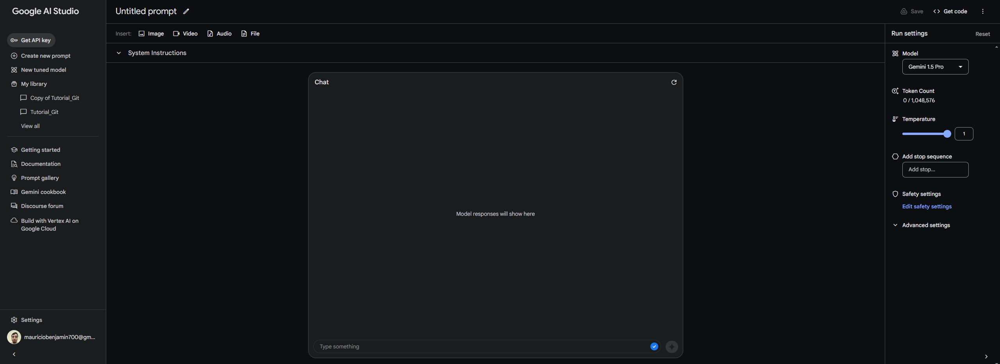
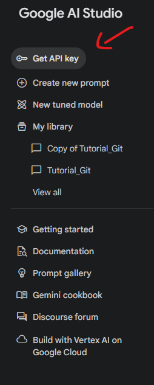
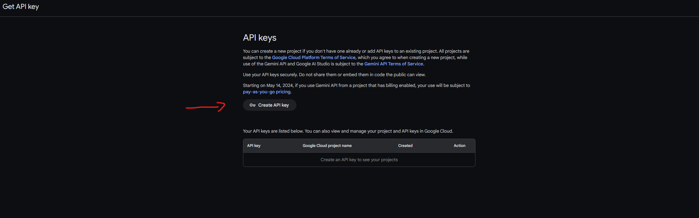
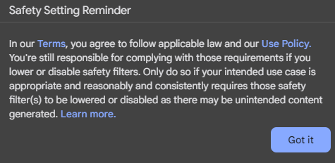
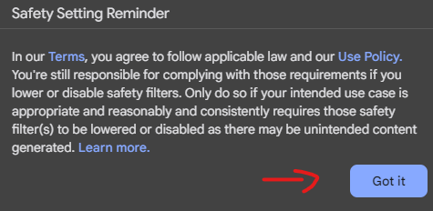
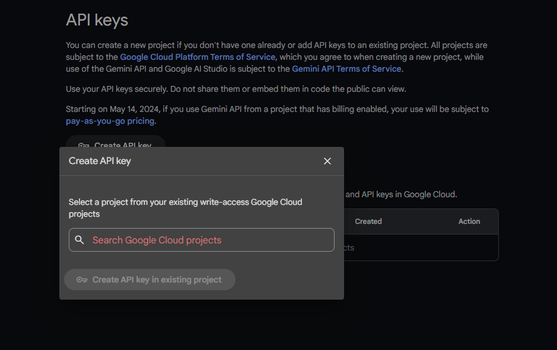
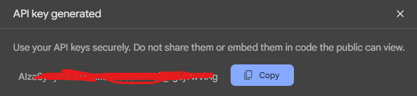

# Passo a Passo para Conseguir Sua API Key do Gemini

Acesse o [Google IA Studio](https://aistudio.google.com/app/prompts/new_chat)

Você irá se deparar com uma interface semelhante a essa:

Clique no botão `Get API Key`

Crie Sua Propria Chave de API

Leia os Termos e decida se vale ou não apena para você! (Dica: Vale super apena)

Caso tenha algum projeto já criado, pode apenas adicionar o mesmo buscando no campo vermelho a baixo. Caso seja um projeto novo, pode apenas fechar o popup e o código de sua API estará na tela.

Na "Raiz" do Projeto, Crie um Arquivo chamado `API-KEY.txt` e cole sua chave dentro dele.

